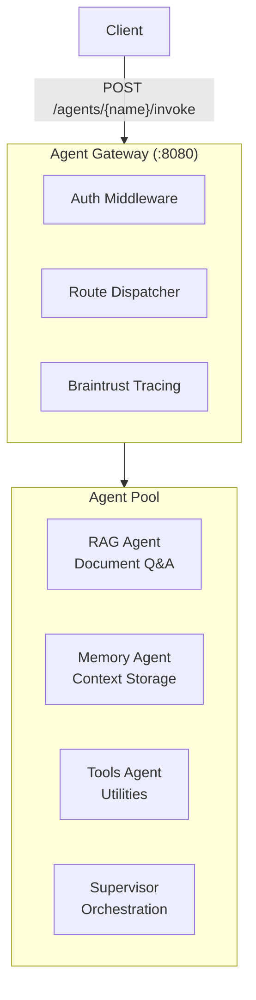

# AI Agents Development Guide

This guide covers developing, deploying, and operating AI agents in the nx-playground platform.

## Table of Contents

- [Overview](#overview)
- [Agent Types](#agent-types)
- [Getting Started](#getting-started)
- [Agent Gateway](#agent-gateway)
- [Creating a New Agent](#creating-a-new-agent)
- [Tracing & Observability](#tracing--observability)
- [Deployment](#deployment)
- [Best Practices](#best-practices)

---

## Overview

The platform supports multiple AI agent patterns built on LangChain/LangGraph with a unified gateway for access control, routing, and observability.



---

## Agent Types

| Agent | Purpose | Model | Location |
|-------|---------|-------|----------|
| **RAG Agent** | Document search & Q&A | Claude 3.5 Sonnet | `apps/agents/rag-agent` |
| **Memory Agent** | User context persistence | Claude 3.5 Sonnet | `apps/agents/code-tester` |
| **Tools Agent** | Calculator, time, weather | Claude Haiku | `apps/agents/whatsup-agent` |
| **Supervisor** | Multi-agent orchestration | Claude Sonnet 4 | `apps/agents/supervisor-langgraph` |
| **ADK Supervisor** | Google ADK orchestration | Gemini 2.0 Flash | `apps/agents/supervisor-adk` |

---

## Getting Started

### Prerequisites

```bash
# Install dependencies
bun install

# Set up environment variables
cp apps/agents/rag-agent/.env.example apps/agents/rag-agent/.env
```

### Required Environment Variables

```bash
# LLM Providers
ANTHROPIC_API_KEY=sk-ant-...
OPENAI_API_KEY=sk-...

# Vector Stores (for RAG)
ELASTICSEARCH_URL=https://...
PINECONE_API_KEY=...
MONGODB_URI=mongodb+srv://...

# Tracing
BRAINTRUST_API_KEY=...
LANGSMITH_API_KEY=...

# Agent Gateway
AGENT_API_KEYS=key1,key2,key3
JWT_SECRET=your-secret-key
```

### Running Agents Locally

```bash
# Run RAG Agent
cd apps/agents/rag-agent
bun run dev

# Run Memory Agent
cd apps/agents/code-tester
bun run dev

# Run Agent Gateway
cd apps/agents/gateway
bun run dev

# Run with LangGraph Studio
cd apps/agents/supervisor-langgraph
bun run studio
```

---

## Agent Gateway

The gateway provides unified access to all agents with authentication, rate limiting, and tracing.

### Endpoints

| Endpoint | Method | Description |
|----------|--------|-------------|
| `/health` | GET | Liveness probe |
| `/ready` | GET | Readiness probe (checks all agents) |
| `/agents` | GET | List all registered agents |
| `/agents/{name}` | GET | Get agent details |
| `/agents/{name}/invoke` | POST | Invoke agent |
| `/agents/{name}/stream` | POST | Stream response (SSE) |
| `/agents/{name}/health` | GET | Check agent health |
| `/.well-known/agent-card.json` | GET | A2A discovery |
| `/metrics` | GET | Prometheus metrics |

### Authentication

```bash
# Using API Key
curl -X POST http://localhost:8080/agents/rag/invoke \
  -H "X-API-Key: your-api-key" \
  -H "Content-Type: application/json" \
  -d '{"messages": [{"role": "user", "content": "Search for auth docs"}]}'

# Using JWT
curl -X POST http://localhost:8080/agents/rag/invoke \
  -H "Authorization: Bearer eyJhbG..." \
  -H "Content-Type: application/json" \
  -d '{"messages": [{"role": "user", "content": "Search for auth docs"}]}'
```

### Request Format

```typescript
interface InvokeRequest {
  messages: Array<{
    role: 'user' | 'assistant' | 'system';
    content: string;
  }>;
  config?: {
    // Agent-specific configuration
    embeddingModel?: string;
    retrieverProvider?: string;
    // ...
  };
  metadata?: {
    userId?: string;
    sessionId?: string;
    // ...
  };
}
```

### Response Format

```typescript
interface InvokeResponse {
  requestId: string;
  agentName: string;
  messages: Array<{
    role: string;
    content: string;
  }>;
  metadata?: Record<string, unknown>;
}
```

---

## Creating a New Agent

### 1. Create Agent Structure

```bash
mkdir -p apps/agents/my-agent/src
cd apps/agents/my-agent
```

### 2. Initialize Package

```json
{
  "name": "@org/my-agent",
  "type": "module",
  "scripts": {
    "dev": "tsx watch src/index.ts",
    "build": "tsc",
    "studio": "npx @langchain/langgraph-cli dev"
  },
  "dependencies": {
    "@langchain/anthropic": "^0.3.0",
    "@langchain/core": "^0.3.0",
    "@langchain/langgraph": "^0.2.0",
    "zod": "^3.23.0"
  }
}
```

### 3. Create Graph

```typescript
// src/graph.ts
import { StateGraph, Annotation } from '@langchain/langgraph';
import { ChatAnthropic } from '@langchain/anthropic';

// Define state
const StateAnnotation = Annotation.Root({
  messages: Annotation<BaseMessage[]>({
    reducer: (prev, next) => [...prev, ...next],
    default: () => [],
  }),
});

// Create model
const model = new ChatAnthropic({
  modelName: 'claude-3-5-sonnet-20241022',
});

// Define nodes
async function processMessage(state: typeof StateAnnotation.State) {
  const response = await model.invoke(state.messages);
  return { messages: [response] };
}

// Build graph
const workflow = new StateGraph(StateAnnotation)
  .addNode('process', processMessage)
  .addEdge('__start__', 'process')
  .addEdge('process', '__end__');

export const graph = workflow.compile();
```

### 4. Add to LangGraph Config

```json
// langgraph.json
{
  "node_version": "22",
  "graphs": {
    "my-agent": "./src/graph.ts:graph"
  },
  "env": ".env"
}
```

### 5. Create HTTP Server (Optional)

```typescript
// src/server.ts
import express from 'express';
import { graph } from './graph.js';

const app = express();
app.use(express.json());

app.get('/health', (req, res) => {
  res.json({ status: 'ok' });
});

app.post('/invoke', async (req, res) => {
  const { messages, config } = req.body;
  const result = await graph.invoke({ messages }, config);
  res.json(result);
});

app.listen(process.env.PORT || 3000);
```

### 6. Register with Gateway

Add to `apps/agents/gateway/src/registry.ts`:

```typescript
{
  name: 'my-agent',
  description: 'My custom agent',
  url: process.env.MY_AGENT_URL || 'http://localhost:3004',
  protocol: 'http',
  tags: ['custom'],
}
```

---

## Tracing & Observability

### Braintrust Integration

The gateway automatically traces all agent invocations to Braintrust.

```bash
# Set API key
export BRAINTRUST_API_KEY=your-key
export BRAINTRUST_PROJECT=agent-gateway
```

Traces include:
- Request/response payloads
- Latency metrics
- Success/failure scores
- Token usage (if available)

### LangSmith Integration

For detailed LLM tracing within agents:

```bash
export LANGCHAIN_TRACING_V2=true
export LANGCHAIN_API_KEY=your-langsmith-key
export LANGCHAIN_PROJECT=my-agent
```

### Custom Metrics

Agents can emit custom metrics:

```typescript
// In your agent code
import { createSpan, endSpan } from '@org/agent-gateway/tracing';

const span = createSpan('my-operation');
try {
  // Do work
  await endSpan(span, {
    name: 'my-operation',
    input: { query },
    output: { result },
    metadata: { model: 'claude-3-5-sonnet' },
  });
} catch (error) {
  await endSpan(span, { name: 'my-operation', error });
}
```

---

## Deployment

### Local Development

```bash
# Start all agents
docker-compose -f manifests/dockers/agents-compose.yaml up -d

# Or run individually
bun run --filter @org/agent-gateway dev
bun run --filter @org/rag-agent dev
```

### Kubernetes Deployment

```bash
# Deploy agent gateway
kubectl apply -k apps/agents/gateway/k8s/kustomize/overlays/dev

# Deploy individual agents
kubectl apply -k apps/agents/rag-agent/k8s/

# Apply hardening
kubectl apply -k k8s/hardening/base
```

### Environment-Specific Configuration

```yaml
# k8s/agents/overlays/prod/kustomization.yaml
apiVersion: kustomize.config.k8s.io/v1beta1
kind: Kustomization

resources:
  - ../../base

patches:
  - target:
      kind: Deployment
      name: agent-gateway
    patch: |-
      - op: replace
        path: /spec/replicas
        value: 3
      - op: add
        path: /spec/template/spec/containers/0/env/-
        value:
          name: LOG_LEVEL
          value: "warn"
```

---

## Best Practices

### 1. Error Handling

```typescript
async function safeInvoke(agent: CompiledGraph, input: unknown) {
  try {
    return await agent.invoke(input);
  } catch (error) {
    if (error.code === 'rate_limit_exceeded') {
      // Implement exponential backoff
      await sleep(1000);
      return safeInvoke(agent, input);
    }
    throw error;
  }
}
```

### 2. Cost Control

```typescript
// Use cheaper models for simple tasks
const routingModel = new ChatAnthropic({ modelName: 'claude-3-haiku-20240307' });
const reasoningModel = new ChatAnthropic({ modelName: 'claude-3-5-sonnet-20241022' });

// Cache embeddings
const embeddingCache = new Map();
async function getEmbedding(text: string) {
  if (embeddingCache.has(text)) return embeddingCache.get(text);
  const embedding = await embeddings.embedQuery(text);
  embeddingCache.set(text, embedding);
  return embedding;
}
```

### 3. Security

```typescript
// Validate inputs
const InputSchema = z.object({
  messages: z.array(z.object({
    role: z.enum(['user', 'assistant', 'system']),
    content: z.string().max(10000), // Limit content length
  })).max(100), // Limit message count
});

// Sanitize outputs
function sanitizeResponse(response: string): string {
  // Remove any sensitive patterns
  return response.replace(/\b[A-Za-z0-9._%+-]+@[A-Za-z0-9.-]+\.[A-Z|a-z]{2,}\b/g, '[EMAIL REDACTED]');
}
```

### 4. Testing

```typescript
// Unit test for agent
describe('RAG Agent', () => {
  it('should retrieve relevant documents', async () => {
    const result = await graph.invoke({
      messages: [{ role: 'user', content: 'What is authentication?' }],
    });

    expect(result.messages).toHaveLength(2);
    expect(result.messages[1].content).toContain('authentication');
  });
});

// Integration test with mock LLM
const mockModel = new FakeListChatModel({
  responses: ['Mocked response'],
});
```

### 5. Graceful Degradation

```typescript
async function invokeWithFallback(primary: Agent, fallback: Agent, input: unknown) {
  try {
    return await primary.invoke(input);
  } catch (error) {
    console.warn('Primary agent failed, using fallback:', error);
    return await fallback.invoke(input);
  }
}
```

---

## Monitoring

### Key Metrics to Watch

| Metric | Warning | Critical |
|--------|---------|----------|
| Agent latency (p95) | > 5s | > 10s |
| Error rate | > 5% | > 20% |
| Token usage/hour | > 100k | > 500k |
| Cost/hour | > $10 | > $50 |

### Alerts

Alerting rules are defined in `k8s/observability/base/alerting-rules.yaml`:

- `AgentGatewayHighErrorRate` - Error rate > 5%
- `AgentUnhealthy` - Agent health check failing
- `HighLLMCostRate` - LLM costs > $50/hour
- `LLMRateLimitHits` - Rate limits being hit

---

## Troubleshooting

See [TROUBLESHOOTING.md](./TROUBLESHOOTING.md) for common issues and solutions.

---

## Related Documentation

- [Architecture Overview](./ARCHITECTURE.md)
- [Deployment Guide](./DEPLOYMENT.md)
- [Testing Guide](./TESTING_GUIDE.md)
