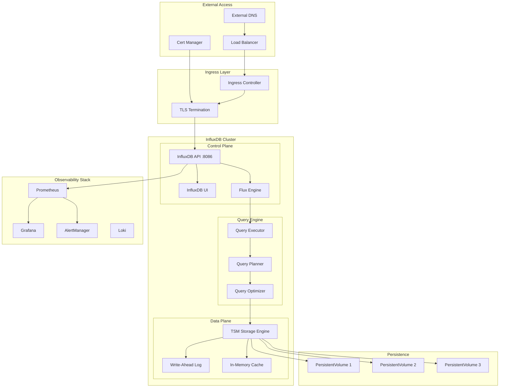
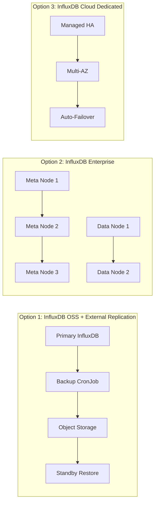

# InfluxDB on Kubernetes: Production-Ready Deployment Guide

## Table of Contents

1. [Architecture Overview](#architecture-overview)
2. [Component Architecture](#component-architecture)
3. [Data Flow](#data-flow)
4. [High Availability Setup](#high-availability-setup)
5. [Storage Architecture](#storage-architecture)
6. [Security Hardening](#security-hardening)
7. [Monitoring & Observability](#monitoring--observability)
8. [Backup & Disaster Recovery](#backup--disaster-recovery)
9. [Scaling Strategies](#scaling-strategies)
10. [Implementation](#implementation)

---

## Architecture Overview

### Production Topology

```
┌─────────────────────────────────────────────────────────────────────────────────┐
│                              KUBERNETES CLUSTER                                  │
│  ┌───────────────────────────────────────────────────────────────────────────┐  │
│  │                         INGRESS LAYER                                      │  │
│  │  ┌─────────────────┐  ┌─────────────────┐  ┌─────────────────┐            │  │
│  │  │  Ingress NGINX  │  │  Cert Manager   │  │  External DNS   │            │  │
│  │  │  (TLS Term.)    │  │  (Let's Encrypt)│  │  (DNS Records)  │            │  │
│  │  └────────┬────────┘  └─────────────────┘  └─────────────────┘            │  │
│  └───────────┼───────────────────────────────────────────────────────────────┘  │
│              │                                                                   │
│  ┌───────────▼───────────────────────────────────────────────────────────────┐  │
│  │                      INFLUXDB NAMESPACE                                    │  │
│  │                                                                            │  │
│  │  ┌──────────────────────────────────────────────────────────────────┐     │  │
│  │  │                    SERVICE MESH (Istio/Linkerd)                   │     │  │
│  │  │  ┌─────────────┐  ┌─────────────┐  ┌─────────────┐               │     │  │
│  │  │  │   mTLS      │  │   Traffic   │  │   Circuit   │               │     │  │
│  │  │  │   Enabled   │  │   Policies  │  │   Breaker   │               │     │  │
│  │  │  └─────────────┘  └─────────────┘  └─────────────┘               │     │  │
│  │  └──────────────────────────────────────────────────────────────────┘     │  │
│  │                                                                            │  │
│  │  ┌────────────────────────────────────────────────────────────────────┐   │  │
│  │  │                     INFLUXDB STATEFULSET                            │   │  │
│  │  │  ┌──────────────┐  ┌──────────────┐  ┌──────────────┐              │   │  │
│  │  │  │InfluxDB Pod 0│  │InfluxDB Pod 1│  │InfluxDB Pod 2│              │   │  │
│  │  │  │  (Primary)   │  │  (Replica)   │  │  (Replica)   │              │   │  │
│  │  │  │              │  │              │  │              │              │   │  │
│  │  │  │ ┌──────────┐ │  │ ┌──────────┐ │  │ ┌──────────┐ │              │   │  │
│  │  │  │ │InfluxDB  │ │  │ │InfluxDB  │ │  │ │InfluxDB  │ │              │   │  │
│  │  │  │ │  2.x     │ │  │ │  2.x     │ │  │ │  2.x     │ │              │   │  │
│  │  │  │ └──────────┘ │  │ └──────────┘ │  │ └──────────┘ │              │   │  │
│  │  │  │ ┌──────────┐ │  │ ┌──────────┐ │  │ ┌──────────┐ │              │   │  │
│  │  │  │ │  Envoy   │ │  │ │  Envoy   │ │  │ │  Envoy   │ │              │   │  │
│  │  │  │ │  Sidecar │ │  │ │  Sidecar │ │  │ │  Sidecar │ │              │   │  │
│  │  │  │ └──────────┘ │  │ └──────────┘ │  │ └──────────┘ │              │   │  │
│  │  │  └──────┬───────┘  └──────┬───────┘  └──────┬───────┘              │   │  │
│  │  │         │                 │                 │                      │   │  │
│  │  │         ▼                 ▼                 ▼                      │   │  │
│  │  │  ┌──────────────┐  ┌──────────────┐  ┌──────────────┐              │   │  │
│  │  │  │     PVC      │  │     PVC      │  │     PVC      │              │   │  │
│  │  │  │  (100Gi SSD) │  │  (100Gi SSD) │  │  (100Gi SSD) │              │   │  │
│  │  │  └──────────────┘  └──────────────┘  └──────────────┘              │   │  │
│  │  └────────────────────────────────────────────────────────────────────┘   │  │
│  │                                                                            │  │
│  │  ┌─────────────────┐  ┌─────────────────┐  ┌─────────────────┐            │  │
│  │  │ Headless Service│  │  ClusterIP Svc  │  │  PodDisruption  │            │  │
│  │  │ (influxdb-hl)   │  │  (influxdb)     │  │    Budget       │            │  │
│  │  └─────────────────┘  └─────────────────┘  └─────────────────┘            │  │
│  └────────────────────────────────────────────────────────────────────────────┘  │
│                                                                                   │
│  ┌────────────────────────────────────────────────────────────────────────────┐  │
│  │                        STORAGE LAYER                                        │  │
│  │  ┌─────────────────────────────────────────────────────────────────────┐   │  │
│  │  │              CSI Driver (GCE-PD / EBS / Azure Disk)                  │   │  │
│  │  │  ┌───────────────┐  ┌───────────────┐  ┌───────────────┐            │   │  │
│  │  │  │   SSD Disk    │  │   SSD Disk    │  │   SSD Disk    │            │   │  │
│  │  │  │   (Zone A)    │  │   (Zone B)    │  │   (Zone C)    │            │   │  │
│  │  │  └───────────────┘  └───────────────┘  └───────────────┘            │   │  │
│  │  └─────────────────────────────────────────────────────────────────────┘   │  │
│  └────────────────────────────────────────────────────────────────────────────┘  │
└─────────────────────────────────────────────────────────────────────────────────┘
```

---

## Component Architecture

### Core Components



### Component Responsibilities

| Component | Purpose | Criticality |
|-----------|---------|-------------|
| **InfluxDB API** | HTTP/gRPC endpoint for all operations | Critical |
| **Flux Engine** | Query language processor | Critical |
| **TSM Engine** | Time-structured merge tree storage | Critical |
| **WAL** | Write durability guarantee | Critical |
| **Cache** | Query acceleration | High |
| **Prometheus** | Metrics collection | High |
| **Grafana** | Visualization | Medium |

---

## Data Flow

### Write Path

```
┌─────────────────────────────────────────────────────────────────────────────┐
│                           WRITE DATA FLOW                                    │
└─────────────────────────────────────────────────────────────────────────────┘

    ┌──────────┐     ┌──────────┐     ┌──────────┐     ┌──────────┐
    │  Client  │────▶│  Ingress │────▶│   mTLS   │────▶│   API    │
    │  (App)   │     │  (NGINX) │     │ (Envoy)  │     │  Server  │
    └──────────┘     └──────────┘     └──────────┘     └────┬─────┘
                                                            │
                    ┌───────────────────────────────────────┘
                    │
                    ▼
    ┌───────────────────────────────────────────────────────────────────────┐
    │                        INFLUXDB WRITE PIPELINE                         │
    │                                                                        │
    │   ┌──────────┐    ┌──────────┐    ┌──────────┐    ┌──────────┐       │
    │   │  Parse   │───▶│ Validate │───▶│  Buffer  │───▶│   WAL    │       │
    │   │  Points  │    │  Schema  │    │  Points  │    │  Write   │       │
    │   └──────────┘    └──────────┘    └──────────┘    └────┬─────┘       │
    │                                                         │             │
    │                        ┌────────────────────────────────┘             │
    │                        │                                              │
    │                        ▼                                              │
    │   ┌──────────┐    ┌──────────┐    ┌──────────┐    ┌──────────┐       │
    │   │  Compac- │◀───│   TSM    │◀───│   Cache  │◀───│  Memory  │       │
    │   │   tion   │    │  Files   │    │  Flush   │    │  Buffer  │       │
    │   └──────────┘    └──────────┘    └──────────┘    └──────────┘       │
    │                                                                        │
    └───────────────────────────────────────────────────────────────────────┘
                    │
                    ▼
    ┌───────────────────────────────────────────────────────────────────────┐
    │                        PERSISTENT STORAGE                              │
    │                                                                        │
    │   ┌─────────────────┐  ┌─────────────────┐  ┌─────────────────┐       │
    │   │   WAL Files     │  │   TSM Files     │  │   Index Files   │       │
    │   │   /data/wal     │  │   /data/engine  │  │   /data/index   │       │
    │   └─────────────────┘  └─────────────────┘  └─────────────────┘       │
    │                                                                        │
    └───────────────────────────────────────────────────────────────────────┘
```

### Read/Query Path

```
┌─────────────────────────────────────────────────────────────────────────────┐
│                           QUERY DATA FLOW                                    │
└─────────────────────────────────────────────────────────────────────────────┘

    ┌──────────┐     ┌──────────┐     ┌──────────┐     ┌──────────┐
    │  Client  │────▶│  Ingress │────▶│   mTLS   │────▶│   API    │
    │  (App)   │     │  (NGINX) │     │ (Envoy)  │     │  Server  │
    └──────────┘     └──────────┘     └──────────┘     └────┬─────┘
                                                            │
                                                            ▼
    ┌───────────────────────────────────────────────────────────────────────┐
    │                        FLUX QUERY PIPELINE                             │
    │                                                                        │
    │   ┌──────────┐    ┌──────────┐    ┌──────────┐    ┌──────────┐       │
    │   │  Parse   │───▶│  Plan    │───▶│ Optimize │───▶│ Execute  │       │
    │   │  Flux    │    │  Query   │    │  Query   │    │  Plan    │       │
    │   └──────────┘    └──────────┘    └──────────┘    └────┬─────┘       │
    │                                                         │             │
    └─────────────────────────────────────────────────────────┼─────────────┘
                                                              │
                    ┌─────────────────────────────────────────┘
                    │
                    ▼
    ┌───────────────────────────────────────────────────────────────────────┐
    │                        DATA RETRIEVAL                                  │
    │                                                                        │
    │   ┌──────────────────────────────────────────────────────────────┐    │
    │   │                     PARALLEL READ                             │    │
    │   │                                                               │    │
    │   │   ┌──────────┐    ┌──────────┐    ┌──────────┐               │    │
    │   │   │  Cache   │    │   TSM    │    │   WAL    │               │    │
    │   │   │  Lookup  │    │   Scan   │    │   Scan   │               │    │
    │   │   └────┬─────┘    └────┬─────┘    └────┬─────┘               │    │
    │   │        │               │               │                      │    │
    │   │        └───────────────┼───────────────┘                      │    │
    │   │                        │                                      │    │
    │   │                        ▼                                      │    │
    │   │                 ┌──────────┐                                  │    │
    │   │                 │  Merge   │                                  │    │
    │   │                 │ Results  │                                  │    │
    │   │                 └──────────┘                                  │    │
    │   │                                                               │    │
    │   └──────────────────────────────────────────────────────────────┘    │
    │                                                                        │
    └───────────────────────────────────────────────────────────────────────┘
                    │
                    ▼
    ┌───────────────────────────────────────────────────────────────────────┐
    │   ┌──────────┐    ┌──────────┐    ┌──────────┐    ┌──────────┐       │
    │   │ Transform│───▶│ Aggregate│───▶│  Format  │───▶│ Response │       │
    │   │   Data   │    │  Results │    │  Output  │    │   JSON   │       │
    │   └──────────┘    └──────────┘    └──────────┘    └──────────┘       │
    └───────────────────────────────────────────────────────────────────────┘
```

---

## High Availability Setup

### Multi-Zone Deployment Architecture

```
┌─────────────────────────────────────────────────────────────────────────────┐
│                     MULTI-ZONE HA ARCHITECTURE                               │
└─────────────────────────────────────────────────────────────────────────────┘

┌─────────────────────────────────────────────────────────────────────────────┐
│                            REGION: us-central1                               │
│                                                                              │
│  ┌──────────────────────┐  ┌──────────────────────┐  ┌────────────────────┐ │
│  │      ZONE A          │  │      ZONE B          │  │      ZONE C        │ │
│  │                      │  │                      │  │                    │ │
│  │  ┌────────────────┐  │  │  ┌────────────────┐  │  │  ┌──────────────┐  │ │
│  │  │  K8s Node      │  │  │  │  K8s Node      │  │  │  │  K8s Node    │  │ │
│  │  │  (n2-highmem)  │  │  │  │  (n2-highmem)  │  │  │  │ (n2-highmem) │  │ │
│  │  │                │  │  │  │                │  │  │  │              │  │ │
│  │  │ ┌────────────┐ │  │  │  │ ┌────────────┐ │  │  │  │┌────────────┐│  │ │
│  │  │ │InfluxDB-0  │ │  │  │  │ │InfluxDB-1  │ │  │  │  ││InfluxDB-2 ││  │ │
│  │  │ │ (Primary)  │ │  │  │  │ │ (Standby)  │ │  │  │  ││ (Standby) ││  │ │
│  │  │ └─────┬──────┘ │  │  │  │ └─────┬──────┘ │  │  │  │└─────┬──────┘│  │ │
│  │  │       │        │  │  │  │       │        │  │  │  │      │       │  │ │
│  │  │ ┌─────▼──────┐ │  │  │  │ ┌─────▼──────┐ │  │  │  │┌─────▼──────┐│  │ │
│  │  │ │  SSD PV    │ │  │  │  │ │  SSD PV    │ │  │  │  ││  SSD PV   ││  │ │
│  │  │ │  100Gi     │ │  │  │  │ │  100Gi     │ │  │  │  ││  100Gi    ││  │ │
│  │  │ └────────────┘ │  │  │  │ └────────────┘ │  │  │  │└────────────┘│  │ │
│  │  └────────────────┘  │  │  └────────────────┘  │  │  └──────────────┘  │ │
│  └──────────────────────┘  └──────────────────────┘  └────────────────────┘ │
│                                                                              │
│  ┌──────────────────────────────────────────────────────────────────────┐   │
│  │                    GLOBAL LOAD BALANCER                               │   │
│  │                                                                       │   │
│  │   ┌─────────────┐    ┌─────────────┐    ┌─────────────┐              │   │
│  │   │  Frontend   │───▶│  Backend    │───▶│  Health     │              │   │
│  │   │  (HTTPS)    │    │  Services   │    │  Checks     │              │   │
│  │   └─────────────┘    └─────────────┘    └─────────────┘              │   │
│  └──────────────────────────────────────────────────────────────────────┘   │
│                                                                              │
│  ┌──────────────────────────────────────────────────────────────────────┐   │
│  │                    BACKUP TO GCS/S3                                   │   │
│  │   ┌────────────────────────────────────────────────────────┐         │   │
│  │   │  Daily Snapshots → Regional Bucket → Cross-Region Copy │         │   │
│  │   └────────────────────────────────────────────────────────┘         │   │
│  └──────────────────────────────────────────────────────────────────────┘   │
└─────────────────────────────────────────────────────────────────────────────┘
```

### HA Configuration Options



---

## Storage Architecture

### Storage Tiers

```
┌─────────────────────────────────────────────────────────────────────────────┐
│                        STORAGE ARCHITECTURE                                  │
└─────────────────────────────────────────────────────────────────────────────┘

┌─────────────────────────────────────────────────────────────────────────────┐
│                              HOT TIER                                        │
│                         (Recent Data: 0-7 days)                              │
│                                                                              │
│   Storage Class: premium-rwo (SSD)                                          │
│   IOPS: 30,000+                                                             │
│   Throughput: 1,200 MB/s                                                    │
│                                                                              │
│   ┌─────────────────────────────────────────────────────────────────────┐   │
│   │  ┌───────────────┐  ┌───────────────┐  ┌───────────────┐           │   │
│   │  │   WAL Data    │  │  Active TSM   │  │    Cache      │           │   │
│   │  │   (Writes)    │  │   (Recent)    │  │   (Memory)    │           │   │
│   │  └───────────────┘  └───────────────┘  └───────────────┘           │   │
│   └─────────────────────────────────────────────────────────────────────┘   │
└─────────────────────────────────────────────────────────────────────────────┘
                                    │
                                    ▼
┌─────────────────────────────────────────────────────────────────────────────┐
│                              WARM TIER                                       │
│                        (Older Data: 7-90 days)                               │
│                                                                              │
│   Storage Class: standard-rwo (Balanced SSD)                                │
│   IOPS: 15,000                                                              │
│   Throughput: 400 MB/s                                                      │
│                                                                              │
│   ┌─────────────────────────────────────────────────────────────────────┐   │
│   │  ┌───────────────┐  ┌───────────────┐                               │   │
│   │  │  Compacted    │  │  Historical   │                               │   │
│   │  │   TSM Files   │  │   Indexes     │                               │   │
│   │  └───────────────┘  └───────────────┘                               │   │
│   └─────────────────────────────────────────────────────────────────────┘   │
└─────────────────────────────────────────────────────────────────────────────┘
                                    │
                                    ▼
┌─────────────────────────────────────────────────────────────────────────────┐
│                              COLD TIER                                       │
│                        (Archive: 90+ days)                                   │
│                                                                              │
│   Storage: Object Storage (GCS/S3)                                          │
│   Cost: ~$0.02/GB/month                                                     │
│                                                                              │
│   ┌─────────────────────────────────────────────────────────────────────┐   │
│   │  ┌───────────────┐  ┌───────────────┐  ┌───────────────┐           │   │
│   │  │   Archived    │  │   Compressed  │  │   Encrypted   │           │   │
│   │  │   Snapshots   │  │   Backups     │  │   At Rest     │           │   │
│   │  └───────────────┘  └───────────────┘  └───────────────┘           │   │
│   └─────────────────────────────────────────────────────────────────────┘   │
└─────────────────────────────────────────────────────────────────────────────┘
```

### StorageClass Configuration

```yaml
# Premium SSD for InfluxDB (GKE example)
apiVersion: storage.k8s.io/v1
kind: StorageClass
metadata:
  name: influxdb-premium
provisioner: pd.csi.storage.gke.io
parameters:
  type: pd-ssd
  replication-type: regional-pd  # Regional replication
volumeBindingMode: WaitForFirstConsumer
allowVolumeExpansion: true
reclaimPolicy: Retain
```

---

## Security Hardening

### Security Layers

```
┌─────────────────────────────────────────────────────────────────────────────┐
│                        SECURITY ARCHITECTURE                                 │
└─────────────────────────────────────────────────────────────────────────────┘

┌─────────────────────────────────────────────────────────────────────────────┐
│  LAYER 1: NETWORK SECURITY                                                   │
│  ┌─────────────────────────────────────────────────────────────────────┐    │
│  │  ┌─────────────┐  ┌─────────────┐  ┌─────────────┐  ┌────────────┐ │    │
│  │  │   Network   │  │   Ingress   │  │   Egress    │  │   Service  │ │    │
│  │  │   Policies  │  │   Rules     │  │   Rules     │  │    Mesh    │ │    │
│  │  │             │  │             │  │             │  │   (mTLS)   │ │    │
│  │  └─────────────┘  └─────────────┘  └─────────────┘  └────────────┘ │    │
│  └─────────────────────────────────────────────────────────────────────┘    │
└─────────────────────────────────────────────────────────────────────────────┘
                                    │
                                    ▼
┌─────────────────────────────────────────────────────────────────────────────┐
│  LAYER 2: AUTHENTICATION & AUTHORIZATION                                     │
│  ┌─────────────────────────────────────────────────────────────────────┐    │
│  │  ┌─────────────┐  ┌─────────────┐  ┌─────────────┐  ┌────────────┐ │    │
│  │  │   API       │  │   RBAC      │  │   Token     │  │   OIDC     │ │    │
│  │  │   Tokens    │  │   Policies  │  │   Rotation  │  │   (SSO)    │ │    │
│  │  └─────────────┘  └─────────────┘  └─────────────┘  └────────────┘ │    │
│  └─────────────────────────────────────────────────────────────────────┘    │
└─────────────────────────────────────────────────────────────────────────────┘
                                    │
                                    ▼
┌─────────────────────────────────────────────────────────────────────────────┐
│  LAYER 3: DATA SECURITY                                                      │
│  ┌─────────────────────────────────────────────────────────────────────┐    │
│  │  ┌─────────────┐  ┌─────────────┐  ┌─────────────┐  ┌────────────┐ │    │
│  │  │ Encryption  │  │ Encryption  │  │   Secrets   │  │   Audit    │ │    │
│  │  │  at Rest    │  │ in Transit  │  │ Management  │  │   Logs     │ │    │
│  │  │  (AES-256)  │  │   (TLS 1.3) │  │  (Vault)    │  │            │ │    │
│  │  └─────────────┘  └─────────────┘  └─────────────┘  └────────────┘ │    │
│  └─────────────────────────────────────────────────────────────────────┘    │
└─────────────────────────────────────────────────────────────────────────────┘
                                    │
                                    ▼
┌─────────────────────────────────────────────────────────────────────────────┐
│  LAYER 4: POD SECURITY                                                       │
│  ┌─────────────────────────────────────────────────────────────────────┐    │
│  │  ┌─────────────┐  ┌─────────────┐  ┌─────────────┐  ┌────────────┐ │    │
│  │  │    Pod      │  │  Security   │  │  Read-Only  │  │  Resource  │ │    │
│  │  │  Security   │  │  Context    │  │    Root     │  │   Limits   │ │    │
│  │  │  Standards  │  │ (non-root)  │  │  Filesystem │  │            │ │    │
│  │  └─────────────┘  └─────────────┘  └─────────────┘  └────────────┘ │    │
│  └─────────────────────────────────────────────────────────────────────┘    │
└─────────────────────────────────────────────────────────────────────────────┘
```

### Network Policy

```yaml
apiVersion: networking.k8s.io/v1
kind: NetworkPolicy
metadata:
  name: influxdb-network-policy
  namespace: influxdb
spec:
  podSelector:
    matchLabels:
      app: influxdb
  policyTypes:
    - Ingress
    - Egress
  ingress:
    # Allow from ingress controller
    - from:
        - namespaceSelector:
            matchLabels:
              name: ingress-nginx
      ports:
        - protocol: TCP
          port: 8086
    # Allow from application namespaces
    - from:
        - namespaceSelector:
            matchLabels:
              influxdb-access: "true"
      ports:
        - protocol: TCP
          port: 8086
    # Allow Prometheus scraping
    - from:
        - namespaceSelector:
            matchLabels:
              name: monitoring
      ports:
        - protocol: TCP
          port: 8086
  egress:
    # DNS
    - to:
        - namespaceSelector: {}
      ports:
        - protocol: UDP
          port: 53
    # Object storage for backups
    - to:
        - ipBlock:
            cidr: 0.0.0.0/0
      ports:
        - protocol: TCP
          port: 443
```

---

## Monitoring & Observability

### Observability Stack Integration

```
┌─────────────────────────────────────────────────────────────────────────────┐
│                     OBSERVABILITY ARCHITECTURE                               │
└─────────────────────────────────────────────────────────────────────────────┘

┌─────────────────────────────────────────────────────────────────────────────┐
│                                                                              │
│   ┌─────────────┐         ┌─────────────┐         ┌─────────────┐          │
│   │  InfluxDB   │────────▶│  Prometheus │────────▶│  Grafana    │          │
│   │  /metrics   │         │             │         │  Dashboards │          │
│   └─────────────┘         └──────┬──────┘         └─────────────┘          │
│                                  │                                          │
│                                  ▼                                          │
│                           ┌─────────────┐                                   │
│                           │ AlertManager│                                   │
│                           └──────┬──────┘                                   │
│                                  │                                          │
│           ┌──────────────────────┼──────────────────────┐                   │
│           ▼                      ▼                      ▼                   │
│   ┌─────────────┐         ┌─────────────┐       ┌─────────────┐            │
│   │   Slack     │         │  PagerDuty  │       │    Email    │            │
│   └─────────────┘         └─────────────┘       └─────────────┘            │
│                                                                              │
│   ┌─────────────┐         ┌─────────────┐         ┌─────────────┐          │
│   │  InfluxDB   │────────▶│    Loki     │────────▶│  Grafana    │          │
│   │   Logs      │         │             │         │   Explore   │          │
│   └─────────────┘         └─────────────┘         └─────────────┘          │
│                                                                              │
│   ┌─────────────┐         ┌─────────────┐         ┌─────────────┐          │
│   │  InfluxDB   │────────▶│   Jaeger/   │────────▶│  Grafana    │          │
│   │   Traces    │         │   Tempo     │         │   Traces    │          │
│   └─────────────┘         └─────────────┘         └─────────────┘          │
│                                                                              │
└─────────────────────────────────────────────────────────────────────────────┘
```

### Key Metrics to Monitor

```
┌─────────────────────────────────────────────────────────────────────────────┐
│                         CRITICAL METRICS                                     │
└─────────────────────────────────────────────────────────────────────────────┘

┌──────────────────────────────────────────────────────────────────────────────┐
│  PERFORMANCE METRICS                                                          │
│  ┌─────────────────┬──────────────────────┬─────────────────────────────┐    │
│  │ Metric          │ Threshold            │ Action                      │    │
│  ├─────────────────┼──────────────────────┼─────────────────────────────┤    │
│  │ Write Latency   │ p99 < 100ms          │ Scale horizontally          │    │
│  │ Query Latency   │ p99 < 500ms          │ Add cache/optimize queries  │    │
│  │ Points/sec      │ Monitor trend        │ Capacity planning           │    │
│  │ Active Queries  │ < 100 concurrent     │ Add query limits            │    │
│  └─────────────────┴──────────────────────┴─────────────────────────────┘    │
└──────────────────────────────────────────────────────────────────────────────┘

┌──────────────────────────────────────────────────────────────────────────────┐
│  RESOURCE METRICS                                                             │
│  ┌─────────────────┬──────────────────────┬─────────────────────────────┐    │
│  │ Metric          │ Threshold            │ Action                      │    │
│  ├─────────────────┼──────────────────────┼─────────────────────────────┤    │
│  │ Memory Usage    │ < 80%                │ Increase limits             │    │
│  │ CPU Usage       │ < 70%                │ Scale up/out                │    │
│  │ Disk Usage      │ < 75%                │ Expand PVC                  │    │
│  │ Disk IOPS       │ < 80% capacity       │ Upgrade storage class       │    │
│  └─────────────────┴──────────────────────┴─────────────────────────────┘    │
└──────────────────────────────────────────────────────────────────────────────┘

┌──────────────────────────────────────────────────────────────────────────────┐
│  HEALTH METRICS                                                               │
│  ┌─────────────────┬──────────────────────┬─────────────────────────────┐    │
│  │ Metric          │ Threshold            │ Action                      │    │
│  ├─────────────────┼──────────────────────┼─────────────────────────────┤    │
│  │ Pod Restarts    │ 0 in 24h             │ Investigate root cause      │    │
│  │ Error Rate      │ < 0.1%               │ Check logs                  │    │
│  │ Compaction      │ Completing normally  │ Check disk space            │    │
│  │ WAL Size        │ < 1GB                │ Investigate write issues    │    │
│  └─────────────────┴──────────────────────┴─────────────────────────────┘    │
└──────────────────────────────────────────────────────────────────────────────┘
```

---

## Backup & Disaster Recovery

### Backup Strategy

```
┌─────────────────────────────────────────────────────────────────────────────┐
│                      BACKUP & RECOVERY STRATEGY                              │
└─────────────────────────────────────────────────────────────────────────────┘

┌─────────────────────────────────────────────────────────────────────────────┐
│                         BACKUP TIERS                                         │
│                                                                              │
│   ┌──────────────────────────────────────────────────────────────────────┐  │
│   │  TIER 1: CONTINUOUS                                                   │  │
│   │  ┌────────────────────────────────────────────────────────────────┐  │  │
│   │  │  WAL-based replication (if Enterprise)                         │  │  │
│   │  │  RPO: < 1 minute                                               │  │  │
│   │  │  RTO: < 5 minutes                                              │  │  │
│   │  └────────────────────────────────────────────────────────────────┘  │  │
│   └──────────────────────────────────────────────────────────────────────┘  │
│                                    │                                         │
│                                    ▼                                         │
│   ┌──────────────────────────────────────────────────────────────────────┐  │
│   │  TIER 2: HOURLY SNAPSHOTS                                            │  │
│   │  ┌────────────────────────────────────────────────────────────────┐  │  │
│   │  │  Volume snapshots via CSI                                      │  │  │
│   │  │  RPO: < 1 hour                                                 │  │  │
│   │  │  RTO: < 30 minutes                                             │  │  │
│   │  │  Retention: 24 hours                                           │  │  │
│   │  └────────────────────────────────────────────────────────────────┘  │  │
│   └──────────────────────────────────────────────────────────────────────┘  │
│                                    │                                         │
│                                    ▼                                         │
│   ┌──────────────────────────────────────────────────────────────────────┐  │
│   │  TIER 3: DAILY BACKUPS                                               │  │
│   │  ┌────────────────────────────────────────────────────────────────┐  │  │
│   │  │  influx backup → Object Storage (GCS/S3)                       │  │  │
│   │  │  RPO: < 24 hours                                               │  │  │
│   │  │  RTO: < 2 hours                                                │  │  │
│   │  │  Retention: 30 days                                            │  │  │
│   │  └────────────────────────────────────────────────────────────────┘  │  │
│   └──────────────────────────────────────────────────────────────────────┘  │
│                                    │                                         │
│                                    ▼                                         │
│   ┌──────────────────────────────────────────────────────────────────────┐  │
│   │  TIER 4: WEEKLY CROSS-REGION                                         │  │
│   │  ┌────────────────────────────────────────────────────────────────┐  │  │
│   │  │  Cross-region replication of backups                           │  │  │
│   │  │  RPO: < 7 days                                                 │  │  │
│   │  │  RTO: < 4 hours                                                │  │  │
│   │  │  Retention: 1 year                                             │  │  │
│   │  └────────────────────────────────────────────────────────────────┘  │  │
│   └──────────────────────────────────────────────────────────────────────┘  │
└─────────────────────────────────────────────────────────────────────────────┘
```

### Backup CronJob

```yaml
apiVersion: batch/v1
kind: CronJob
metadata:
  name: influxdb-backup
  namespace: influxdb
spec:
  schedule: "0 */6 * * *"  # Every 6 hours
  concurrencyPolicy: Forbid
  successfulJobsHistoryLimit: 3
  failedJobsHistoryLimit: 3
  jobTemplate:
    spec:
      template:
        spec:
          serviceAccountName: influxdb-backup
          containers:
            - name: backup
              image: influxdb:2.7-alpine
              env:
                - name: INFLUX_HOST
                  value: "http://influxdb:8086"
                - name: INFLUX_TOKEN
                  valueFrom:
                    secretKeyRef:
                      name: influxdb-admin-token
                      key: token
              command:
                - /bin/sh
                - -c
                - |
                  DATE=$(date +%Y%m%d-%H%M%S)
                  influx backup /backup/$DATE --host $INFLUX_HOST --token $INFLUX_TOKEN
                  # Upload to object storage
                  gsutil -m cp -r /backup/$DATE gs://my-bucket/influxdb-backups/
                  # Cleanup local
                  rm -rf /backup/$DATE
              volumeMounts:
                - name: backup-volume
                  mountPath: /backup
          restartPolicy: OnFailure
          volumes:
            - name: backup-volume
              emptyDir: {}
```

---

## Scaling Strategies

### Scaling Decision Tree

```
┌─────────────────────────────────────────────────────────────────────────────┐
│                      SCALING DECISION TREE                                   │
└─────────────────────────────────────────────────────────────────────────────┘

                            ┌─────────────────┐
                            │  Performance    │
                            │    Issue?       │
                            └────────┬────────┘
                                     │
                    ┌────────────────┼────────────────┐
                    ▼                ▼                ▼
            ┌───────────┐    ┌───────────┐    ┌───────────┐
            │   Write   │    │   Query   │    │  Storage  │
            │   Heavy   │    │   Heavy   │    │   Heavy   │
            └─────┬─────┘    └─────┬─────┘    └─────┬─────┘
                  │                │                │
                  ▼                ▼                ▼
        ┌─────────────────┐ ┌─────────────────┐ ┌─────────────────┐
        │ Scale Vertical: │ │ Add Read        │ │ Expand PVC      │
        │ - More CPU      │ │ Replicas        │ │ - Online resize │
        │ - More Memory   │ │ (Enterprise)    │ │                 │
        │ - Faster Disks  │ │                 │ │ Add Storage     │
        └─────────────────┘ │ Add Caching     │ │ Tiers           │
                            │ - Query cache   │ │ - Hot/Warm/Cold │
                            │ - Result cache  │ │                 │
                            └─────────────────┘ │ Enable          │
                                                │ Compression     │
                                                └─────────────────┘

┌─────────────────────────────────────────────────────────────────────────────┐
│                      RESOURCE SIZING GUIDE                                   │
│                                                                              │
│   ┌─────────────┬──────────────┬──────────────┬──────────────────────────┐  │
│   │ Workload    │ CPU          │ Memory       │ Storage                  │  │
│   ├─────────────┼──────────────┼──────────────┼──────────────────────────┤  │
│   │ Small       │ 2 cores      │ 4Gi          │ 50Gi SSD                 │  │
│   │ (<100K pts) │              │              │                          │  │
│   ├─────────────┼──────────────┼──────────────┼──────────────────────────┤  │
│   │ Medium      │ 4 cores      │ 16Gi         │ 200Gi SSD                │  │
│   │ (<1M pts)   │              │              │                          │  │
│   ├─────────────┼──────────────┼──────────────┼──────────────────────────┤  │
│   │ Large       │ 8 cores      │ 32Gi         │ 500Gi SSD                │  │
│   │ (<10M pts)  │              │              │                          │  │
│   ├─────────────┼──────────────┼──────────────┼──────────────────────────┤  │
│   │ X-Large     │ 16+ cores    │ 64Gi+        │ 1Ti+ SSD                 │  │
│   │ (>10M pts)  │              │              │ Consider Enterprise      │  │
│   └─────────────┴──────────────┴──────────────┴──────────────────────────┘  │
└─────────────────────────────────────────────────────────────────────────────┘
```

---

## Implementation

### Complete Production Manifests

#### Namespace and RBAC

```yaml
# namespace.yaml
apiVersion: v1
kind: Namespace
metadata:
  name: influxdb
  labels:
    name: influxdb
    istio-injection: enabled  # If using Istio
---
# service-account.yaml
apiVersion: v1
kind: ServiceAccount
metadata:
  name: influxdb
  namespace: influxdb
---
apiVersion: rbac.authorization.k8s.io/v1
kind: Role
metadata:
  name: influxdb
  namespace: influxdb
rules:
  - apiGroups: [""]
    resources: ["secrets"]
    verbs: ["get", "list"]
---
apiVersion: rbac.authorization.k8s.io/v1
kind: RoleBinding
metadata:
  name: influxdb
  namespace: influxdb
subjects:
  - kind: ServiceAccount
    name: influxdb
roleRef:
  kind: Role
  name: influxdb
  apiGroup: rbac.authorization.k8s.io
```

#### Secrets (use External Secrets Operator in production)

```yaml
# secrets.yaml
apiVersion: v1
kind: Secret
metadata:
  name: influxdb-auth
  namespace: influxdb
type: Opaque
stringData:
  admin-username: admin
  admin-password: "${INFLUXDB_ADMIN_PASSWORD}"  # Replace or use External Secrets
  admin-token: "${INFLUXDB_ADMIN_TOKEN}"
```

#### ConfigMap

```yaml
# configmap.yaml
apiVersion: v1
kind: ConfigMap
metadata:
  name: influxdb-config
  namespace: influxdb
data:
  config.yml: |
    bolt-path: /var/lib/influxdb2/influxd.bolt
    engine-path: /var/lib/influxdb2/engine

    # HTTP Configuration
    http-bind-address: ":8086"
    http-read-header-timeout: "10s"
    http-read-timeout: "0"
    http-write-timeout: "0"
    http-idle-timeout: "3m"

    # Query Configuration
    query-concurrency: 20
    query-queue-size: 100
    query-initial-memory-bytes: 0
    query-max-memory-bytes: 0  # Unlimited
    query-memory-bytes: 0

    # Storage Configuration
    storage-cache-max-memory-size: 1073741824  # 1GB
    storage-cache-snapshot-memory-size: 26214400  # 25MB
    storage-cache-snapshot-write-cold-duration: "10m"
    storage-compact-full-write-cold-duration: "4h"
    storage-compact-throughput-burst: 50331648  # 48MB
    storage-max-concurrent-compactions: 0  # Unlimited
    storage-max-index-log-file-size: 1048576  # 1MB
    storage-no-validate-field-size: false
    storage-retention-check-interval: "30m"
    storage-series-file-max-concurrent-snapshot-compactions: 0
    storage-series-id-set-cache-size: 100
    storage-wal-fsync-delay: "0s"
    storage-wal-max-concurrent-writes: 0
    storage-wal-max-write-delay: "10m"
    storage-write-timeout: "10s"

    # Logging
    log-level: info

    # Metrics
    metrics-disabled: false
```

#### StatefulSet

```yaml
# statefulset.yaml
apiVersion: apps/v1
kind: StatefulSet
metadata:
  name: influxdb
  namespace: influxdb
  labels:
    app: influxdb
spec:
  serviceName: influxdb-headless
  replicas: 1  # InfluxDB OSS is single-node
  selector:
    matchLabels:
      app: influxdb
  template:
    metadata:
      labels:
        app: influxdb
      annotations:
        prometheus.io/scrape: "true"
        prometheus.io/port: "8086"
        prometheus.io/path: "/metrics"
    spec:
      serviceAccountName: influxdb
      securityContext:
        runAsNonRoot: true
        runAsUser: 1000
        runAsGroup: 1000
        fsGroup: 1000

      # Anti-affinity for HA (if running multiple)
      affinity:
        podAntiAffinity:
          preferredDuringSchedulingIgnoredDuringExecution:
            - weight: 100
              podAffinityTerm:
                labelSelector:
                  matchExpressions:
                    - key: app
                      operator: In
                      values:
                        - influxdb
                topologyKey: topology.kubernetes.io/zone
        nodeAffinity:
          requiredDuringSchedulingIgnoredDuringExecution:
            nodeSelectorTerms:
              - matchExpressions:
                  - key: node-type
                    operator: In
                    values:
                      - database

      # Tolerations for dedicated nodes
      tolerations:
        - key: "database"
          operator: "Equal"
          value: "true"
          effect: "NoSchedule"

      containers:
        - name: influxdb
          image: influxdb:2.7-alpine
          imagePullPolicy: IfNotPresent

          ports:
            - name: http
              containerPort: 8086
              protocol: TCP

          env:
            - name: DOCKER_INFLUXDB_INIT_MODE
              value: "setup"
            - name: DOCKER_INFLUXDB_INIT_USERNAME
              valueFrom:
                secretKeyRef:
                  name: influxdb-auth
                  key: admin-username
            - name: DOCKER_INFLUXDB_INIT_PASSWORD
              valueFrom:
                secretKeyRef:
                  name: influxdb-auth
                  key: admin-password
            - name: DOCKER_INFLUXDB_INIT_ADMIN_TOKEN
              valueFrom:
                secretKeyRef:
                  name: influxdb-auth
                  key: admin-token
            - name: DOCKER_INFLUXDB_INIT_ORG
              value: "production"
            - name: DOCKER_INFLUXDB_INIT_BUCKET
              value: "default"
            - name: DOCKER_INFLUXDB_INIT_RETENTION
              value: "30d"
            - name: INFLUXD_CONFIG_PATH
              value: "/etc/influxdb2/config.yml"

          resources:
            requests:
              cpu: "2"
              memory: "8Gi"
            limits:
              cpu: "4"
              memory: "16Gi"

          livenessProbe:
            httpGet:
              path: /health
              port: http
            initialDelaySeconds: 30
            periodSeconds: 10
            timeoutSeconds: 5
            failureThreshold: 6

          readinessProbe:
            httpGet:
              path: /health
              port: http
            initialDelaySeconds: 5
            periodSeconds: 5
            timeoutSeconds: 3
            failureThreshold: 3

          startupProbe:
            httpGet:
              path: /health
              port: http
            initialDelaySeconds: 10
            periodSeconds: 10
            timeoutSeconds: 5
            failureThreshold: 30

          securityContext:
            allowPrivilegeEscalation: false
            readOnlyRootFilesystem: false
            capabilities:
              drop:
                - ALL

          volumeMounts:
            - name: data
              mountPath: /var/lib/influxdb2
            - name: config
              mountPath: /etc/influxdb2
              readOnly: true

      volumes:
        - name: config
          configMap:
            name: influxdb-config

  volumeClaimTemplates:
    - metadata:
        name: data
      spec:
        accessModes:
          - ReadWriteOnce
        storageClassName: influxdb-premium
        resources:
          requests:
            storage: 100Gi
```

#### Services

```yaml
# services.yaml
apiVersion: v1
kind: Service
metadata:
  name: influxdb
  namespace: influxdb
  labels:
    app: influxdb
spec:
  type: ClusterIP
  ports:
    - name: http
      port: 8086
      targetPort: http
  selector:
    app: influxdb
---
apiVersion: v1
kind: Service
metadata:
  name: influxdb-headless
  namespace: influxdb
  labels:
    app: influxdb
spec:
  type: ClusterIP
  clusterIP: None
  ports:
    - name: http
      port: 8086
      targetPort: http
  selector:
    app: influxdb
```

#### PodDisruptionBudget

```yaml
# pdb.yaml
apiVersion: policy/v1
kind: PodDisruptionBudget
metadata:
  name: influxdb
  namespace: influxdb
spec:
  minAvailable: 1
  selector:
    matchLabels:
      app: influxdb
```

#### Ingress

```yaml
# ingress.yaml
apiVersion: networking.k8s.io/v1
kind: Ingress
metadata:
  name: influxdb
  namespace: influxdb
  annotations:
    kubernetes.io/ingress.class: nginx
    cert-manager.io/cluster-issuer: letsencrypt-prod
    nginx.ingress.kubernetes.io/proxy-body-size: "0"
    nginx.ingress.kubernetes.io/proxy-read-timeout: "600"
    nginx.ingress.kubernetes.io/proxy-send-timeout: "600"
spec:
  tls:
    - hosts:
        - influxdb.example.com
      secretName: influxdb-tls
  rules:
    - host: influxdb.example.com
      http:
        paths:
          - path: /
            pathType: Prefix
            backend:
              service:
                name: influxdb
                port:
                  number: 8086
```

#### PrometheusRule for Alerting

```yaml
# prometheus-rules.yaml
apiVersion: monitoring.coreos.com/v1
kind: PrometheusRule
metadata:
  name: influxdb-alerts
  namespace: influxdb
spec:
  groups:
    - name: influxdb
      rules:
        - alert: InfluxDBDown
          expr: up{job="influxdb"} == 0
          for: 5m
          labels:
            severity: critical
          annotations:
            summary: "InfluxDB is down"
            description: "InfluxDB has been down for more than 5 minutes."

        - alert: InfluxDBHighMemoryUsage
          expr: |
            container_memory_usage_bytes{pod=~"influxdb-.*"} /
            container_spec_memory_limit_bytes{pod=~"influxdb-.*"} > 0.85
          for: 5m
          labels:
            severity: warning
          annotations:
            summary: "InfluxDB high memory usage"
            description: "InfluxDB memory usage is above 85%"

        - alert: InfluxDBHighDiskUsage
          expr: |
            (kubelet_volume_stats_used_bytes{persistentvolumeclaim=~"data-influxdb-.*"} /
            kubelet_volume_stats_capacity_bytes{persistentvolumeclaim=~"data-influxdb-.*"}) > 0.80
          for: 10m
          labels:
            severity: warning
          annotations:
            summary: "InfluxDB disk usage high"
            description: "InfluxDB disk usage is above 80%"

        - alert: InfluxDBHighWriteLatency
          expr: |
            histogram_quantile(0.99,
              rate(http_request_duration_seconds_bucket{handler="/api/v2/write"}[5m])
            ) > 0.1
          for: 5m
          labels:
            severity: warning
          annotations:
            summary: "InfluxDB write latency high"
            description: "InfluxDB p99 write latency is above 100ms"
```

---

## Deployment Checklist

### Pre-Deployment

- [ ] Dedicated node pool created with appropriate labels/taints
- [ ] StorageClass created with SSD provisioner
- [ ] Network policies defined
- [ ] Secrets stored in external secrets manager
- [ ] Backup bucket created with appropriate IAM
- [ ] TLS certificates configured
- [ ] Monitoring stack deployed

### Deployment

- [ ] Namespace created with labels
- [ ] RBAC configured
- [ ] ConfigMap applied
- [ ] StatefulSet deployed
- [ ] Services created
- [ ] Ingress configured
- [ ] PDB applied

### Post-Deployment

- [ ] Health checks verified
- [ ] Metrics flowing to Prometheus
- [ ] Alerts configured and tested
- [ ] Backup job running successfully
- [ ] Load testing performed
- [ ] Runbook documented

---

## Quick Reference Commands

```bash
# Deploy all resources
kubectl apply -k ./influxdb/

# Check status
kubectl -n influxdb get pods,pvc,svc

# View logs
kubectl -n influxdb logs -f statefulset/influxdb

# Port forward for local access
kubectl -n influxdb port-forward svc/influxdb 8086:8086

# Manual backup
kubectl -n influxdb exec -it influxdb-0 -- influx backup /tmp/backup

# Restore from backup
kubectl -n influxdb exec -it influxdb-0 -- influx restore /tmp/backup

# Check metrics endpoint
kubectl -n influxdb exec -it influxdb-0 -- curl -s localhost:8086/metrics | head

# Expand PVC (if StorageClass allows)
kubectl -n influxdb patch pvc data-influxdb-0 -p '{"spec":{"resources":{"requests":{"storage":"200Gi"}}}}'
```
