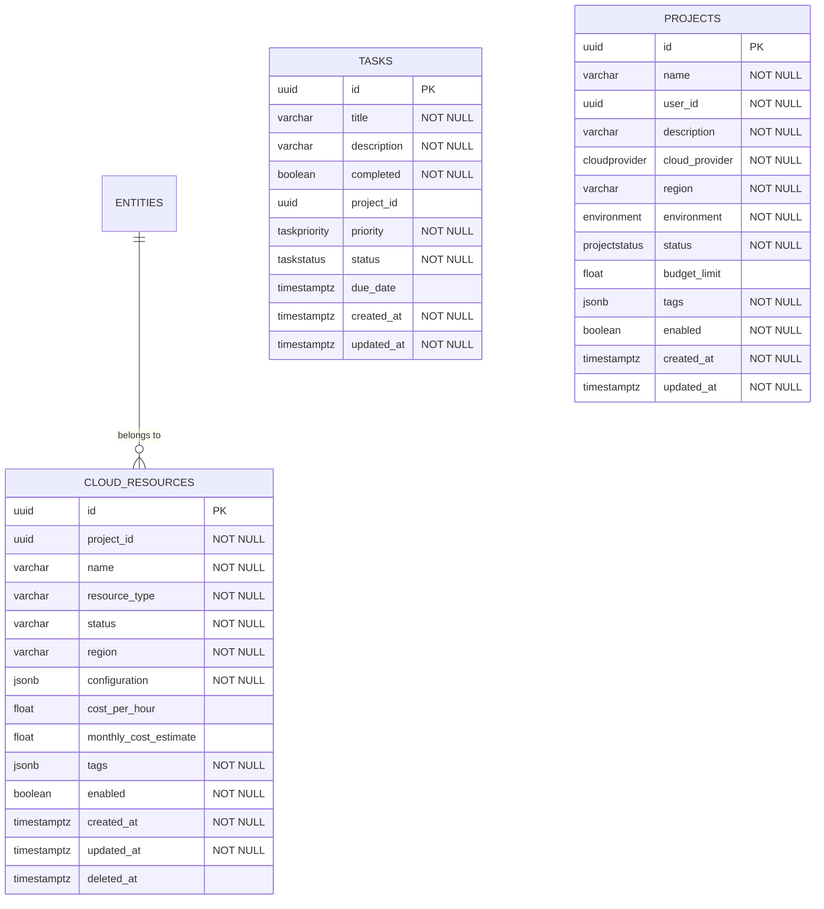

# Database Schema

Auto-generated from SeaORM entities on 2026-01-04 11:25:07 UTC

```mermaid
erDiagram
    ENTITIES ||--o{ CLOUD_RESOURCES : "belongs to"

    TASKS {
        uuid id "PK"
        varchar title "NOT NULL"
        varchar description "NOT NULL"
        boolean completed "NOT NULL"
        uuid project_id
        taskpriority priority "NOT NULL"
        taskstatus status "NOT NULL"
        timestamptz due_date
        timestamptz created_at "NOT NULL"
        timestamptz updated_at "NOT NULL"
    }

    PROJECTS {
        uuid id "PK"
        varchar name "NOT NULL"
        uuid user_id "NOT NULL"
        varchar description "NOT NULL"
        cloudprovider cloud_provider "NOT NULL"
        varchar region "NOT NULL"
        environment environment "NOT NULL"
        projectstatus status "NOT NULL"
        float budget_limit
        jsonb tags "NOT NULL"
        boolean enabled "NOT NULL"
        timestamptz created_at "NOT NULL"
        timestamptz updated_at "NOT NULL"
    }

    CLOUD_RESOURCES {
        uuid id "PK"
        uuid project_id "NOT NULL"
        varchar name "NOT NULL"
        varchar resource_type "NOT NULL"
        varchar status "NOT NULL"
        varchar region "NOT NULL"
        jsonb configuration "NOT NULL"
        float cost_per_hour
        float monthly_cost_estimate
        jsonb tags "NOT NULL"
        boolean enabled "NOT NULL"
        timestamptz created_at "NOT NULL"
        timestamptz updated_at "NOT NULL"
        timestamptz deleted_at
    }

```
